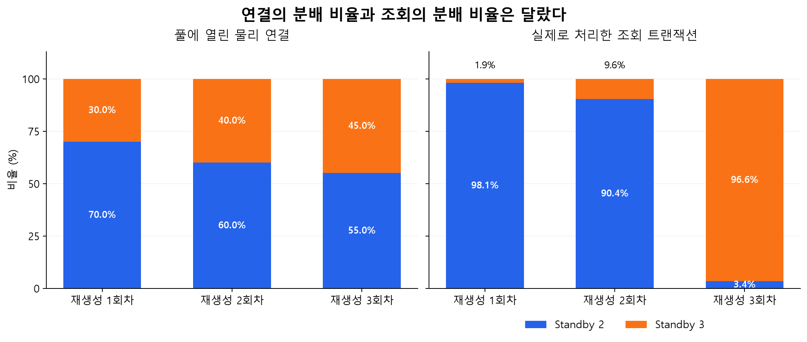
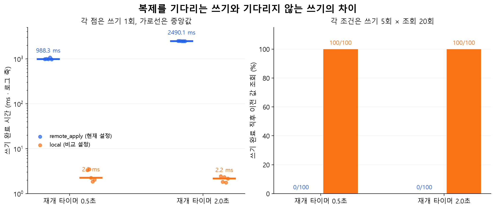

# Komit DB 조회·쓰기 분리 검증 보고서

- 실험일: 2026-10-02, 시각은 한국 표준시(KST)
- 대상: 실행 중인 Komit Service DB와 배포 이미지의 Spring 데이터소스 설정
- 자료: [실험 원본과 재현 코드](./코밋_DB라우팅_실험자료_20261002/README.md)

## 1. 결과 요약

**읽기·쓰기 경로 분리는 정상 동작했다.** 배포 이미지의 데이터소스 설정을 그대로 호출하는 검증기로 현재 DB에 초당 100개의 트랜잭션을 보냈다. 읽기 90%·쓰기 10%로 60초씩 세 번 측정한 18,000건에서, 조회 16,200건은 Standby로, 쓰기 1,800건은 Primary로 전달됐다. 오류와 경로 불일치는 없었다.

**Standby 두 대로 접속한다고 조회가 균등하게 나뉘지는 않았다.** 커넥션풀을 새로 만드는 추가 실험에서는 한 Standby가 조회의 98.1%를 처리했다. 다른 회차에서는 반대 Standby가 96.6%를 처리했다. 풀에 열린 물리 연결의 비율과 실제 조회의 비율도 달랐다.

**현재 설정은 두 Standby의 반영을 기다린 뒤 쓰기를 완료했다.** 현재 DB에서 쓰기 직후 별도 읽기 트랜잭션으로 조회한 2,000회는 모두 방금 쓴 값을 반환했다. 같은 복제 설정의 시험용 DB에서 지연을 재현하자, 쓰기 완료 시간이 약 0.99초·2.49초로 늘어나는 대신 완료 뒤 조회는 최신 값을 반환했다. 시험용 쓰기에서 복제 대기를 생략하면 쓰기는 약 2.2ms에 끝났지만, 지연 중 조회는 이전 값을 반환했다.

실제 API 부하 실험에서는 50 RPS 측정 중 두 앱 Pod의 `OOMKilled`를 확인해 추가 부하를 중단했다. 따라서 위의 **100 TPS 결과는 데이터소스 라우팅 검증기의 결과**이며, 실제 API가 100 RPS를 안정적으로 처리했다는 결과로 사용할 수 없다.

## 2. 검증 질문과 판정 기준

| ID | 검증 질문 | 판정 기준 |
|---|---|---|
| T1 | 읽기 전용 트랜잭션과 쓰기 트랜잭션이 의도한 DB로 가는가? | 읽기 전용은 Standby, 쓰기는 Primary. 오류·경로 불일치 0건 |
| T2 | 연결의 분배 비율이 조회의 분배 비율로 이어지는가? | 물리 연결 수와 실제 조회 수를 각각 측정. 50:50을 통과 기준으로 정하지 않음 |
| T3 | 쓰기 완료 직후 별도 조회에서 방금 쓴 값을 읽는가? | 커밋이 반환된 뒤 새 읽기 트랜잭션에서 고유한 버전 값이 일치 |
| T4 | 복제 지연이 쓰기 완료 시간과 조회 결과에 어떤 영향을 주는가? | 지연 재현 후 `remote_apply`와 `local`의 완료 시간·이전 값 조회 수 비교 |
| T5 | 실제 API 부하에서도 관측 가능한가? | HTTP 응답과 본문 확인. 오류율 1% 이상, p95 1초 초과, Pod 재시작 발생 중 하나라도 해당하면 부하 증가 중단 |

T5의 수치는 실험 중단 기준이다. 서비스의 공식 SLO나 최대 처리량 기준으로 사용하지 않는다.

보고서는 ISTQB의 테스트 완료 보고서 구성과 성능 테스트 보고서 구성을 참고해 목적, 환경, 측정 방법, 결과, 해석, 계획 변경, 재현 자료를 정리했다. [ISTQB CTFL v4.0.1 §5.3.2](https://istqb.org/wp-content/uploads/2024/11/ISTQB_CTFL_Syllabus_v4.0.1.pdf), [ISTQB Performance Testing §4.4](https://istqb.org/wp-content/uploads/2024/11/ISTQB-CT-PT_Syllabus_v1.0_2018.pdf).

## 3. 환경과 측정 방법

### 3.1 현재 서버

| 항목 | 측정 시 확인한 값 |
|---|---|
| 서버 | 단일 K3s 노드, 4 vCPU, 메모리 약 15.4 GiB |
| 앱 이미지 | `komit2026/komit-service:0e992abe` |
| 라이브러리 | Spring JDBC·TX 7.0.9, HikariCP 7.0.2, PostgreSQL JDBC 42.7.13 |
| PostgreSQL | 16.15, CloudNativePG 1.30.0 |
| Service DB | Primary 1대, Standby 2대, 인스턴스당 메모리 한도 512 MiB |
| 쓰기 접속 | `service-db-rw` |
| 읽기 접속 | `service-db-ro` |
| 실제 복제 설정 | `synchronous_commit=remote_apply`, `synchronous_standby_names=ANY 2 (...)` |
| CNPG 복제 정책 | `method=any`, `number=2`, `dataDurability=preferred` |
| 앱 자원 | Pod당 CPU 한도 1 core, 메모리 한도 512 MiB |
| 실제 API 시험 | 앱 5 Pod로 고정. 기존 HPA의 최소 2·최대 5 설정은 시험 뒤 복원 |
| 실제 API 데이터 | 개발자 15건, DB 약 11.3 MiB |

이 환경은 기존 [API 다중화 성능 비교 보고서](./01_포폴재료_코밋_부하테스트보고서.md)의 데이터 규모와 앱 자원 조건이 다르다. 두 보고서의 지연 수치를 직접 비교하지 않는다.

원본: [환경 기록](./코밋_DB라우팅_실험자료_20261002/raw/environment-evidence.json).

### 3.2 라우팅 검증기

서버에서 실행 중인 앱의 `app.jar`에서 `DataSourceRoutingConfig.class`와 의존 라이브러리를 추출했다. 검증기는 이 클래스의 `writeDataSource`, `readDataSource`, `dataSource` 메서드를 직접 호출했다. 읽기·쓰기 설정을 별도로 재구현하지 않았다.

두 JDBC 클라이언트에 각각 읽기·쓰기 풀을 만들었다. 각 풀의 기본 최대 연결 수는 10개다. 읽기 풀은 클라이언트당 10개의 트랜잭션을 동시에 열어 물리 연결 총 20개를 확인했다. 트랜잭션은 `DataSourceTransactionManager`와 `TransactionTemplate`으로 생성했다.

시험 데이터는 현재 Service DB의 별도 스키마에 만든 64개 버전 표식이다. 서비스의 사용자·리뷰·계약 데이터는 시험용 쓰기 대상으로 사용하지 않았다. 검증기의 조회 SQL 한 문장에서 버전 값과 `inet_server_addr()`, `pg_backend_pid()`, `pg_is_in_recovery()`를 함께 읽었다. 따라서 **실제 조회를 실행한 연결의 DB 역할을 판정**했다.

측정 시간은 트랜잭션 실행 직전부터 커밋이 반환될 때까지다. 이 지연에는 DB 접속·풀 대여·SQL·커밋이 포함되고 HTTP·컨트롤러·JPA 로직은 포함되지 않는다. 쓰기 직후 조회는 쓰기 트랜잭션이 끝난 다음 별도 읽기 트랜잭션으로 수행했다.

원본: [검증 코드](./코밋_DB라우팅_실험자료_20261002/scripts/RoutingHarness.java), [배포 클래스 확인](./코밋_DB라우팅_실험자료_20261002/raw/routing-config.javap.txt), [개별 트랜잭션 기록](./코밋_DB라우팅_실험자료_20261002/raw/jdbc-samples.json).

### 3.3 지연 재현 환경

현재 서비스의 복제 처리를 멈추지 않도록 별도 네임스페이스에 PostgreSQL 16.15 Primary 1대·Standby 2대를 만들었다. 메모리 한도와 `remote_apply / ANY 2 / preferred` 설정을 맞췄다. 시험용 DB는 64개 표식을 사용하며 `shared_buffers=64MB`, `max_connections=100`으로 설정했다. 운영 DB 전체를 복제한 환경은 아니다.

두 시험용 Standby에서 WAL 재생을 일시 정지한 뒤, 쓰기 시작 신호에 맞춰 재개 타이머를 걸었다. 매 회차 `ANY 2` 유지와 재생 정지를 확인했다. `local` 비교는 **해당 시험용 쓰기 트랜잭션에만** `SET LOCAL synchronous_commit='local'`을 적용했다. 각 쓰기 완료 뒤 20회 조회하고, 재생을 재개한 뒤 다시 20회 조회했다. 조건마다 5회씩, 설정의 실행 순서를 번갈아 측정했다.

재개 명령은 서버 제어 명령을 통해 전달된다. **타이머 500ms·2,000ms는 실제 지연 500ms·2,000ms와 같지 않다.** 실제 재개 완료까지 걸린 시간도 따로 기록했다.

원본: [시험 DB 설정](./코밋_DB라우팅_실험자료_20261002/raw/lab-manifest.json), [지연 제어 코드](./코밋_DB라우팅_실험자료_20261002/scripts/lab_driver.py).

## 4. 읽기·쓰기 경로 검증 — T1

초당 20건으로 30초 예열한 뒤, 초당 100건의 혼합 부하를 60초씩 세 번 측정했다. 읽기 90%·쓰기 10%와 두 클라이언트의 부하 비율을 고정했다. 세 회차는 같은 JVM과 같은 풀을 유지한 연속 측정이다.

| 회차 | 읽기 → Standby 2 | 읽기 → Standby 3 | 쓰기 → Primary | 오류 | 경로 불일치 | 전체 트랜잭션 p95 |
|---|---:|---:|---:|---:|---:|---:|
| 1 | 2,700 | 2,700 | 600 | 0 | 0 | 3.59ms |
| 2 | 2,700 | 2,700 | 600 | 0 | 0 | 3.56ms |
| 3 | 2,700 | 2,700 | 600 | 0 | 0 | 3.44ms |
| 합계 | 8,100 | 8,100 | 1,800 | 0 | 0 | — |

쓰기 트랜잭션 안에서 읽기 전용 트랜잭션을 호출하는 경우도 100회 확인했다. 모두 Primary에서 읽었다. 외부 쓰기 트랜잭션에 참여하는 조회는 독립적인 Standby 조회와 구분해야 한다.

**판정: T1 통과.** 읽기 전용의 독립 트랜잭션은 Standby, 쓰기 트랜잭션과 그 안의 조회는 Primary라는 경로를 확인했다. 이 단계의 50:50 비율은 사용 중인 풀에서 나온 결과이므로, 풀을 새로 만드는 T2로 분배를 추가 검증했다.

원본: [회차별 집계](./코밋_DB라우팅_실험자료_20261002/raw/jdbc-summary.json).

## 5. 연결 분배와 조회 분배 — T2

같은 설정으로 읽기·쓰기 풀을 닫고 새로 만드는 과정을 세 번 반복했다. 매번 읽기 물리 연결 20개를 연 뒤, 100 TPS 혼합 부하를 10초간 보냈다. 각 회차는 조회 900건·쓰기 100건이며, 오류와 경로 불일치는 없었다.

| 풀 재생성 | 열린 연결: Standby 2 / 3 | 연결 비율 | 조회: Standby 2 / 3 | 조회 비율 |
|---|---|---|---|---|
| 1회차 | 14 / 6 | 70.0% / 30.0% | 883 / 17 | 98.1% / 1.9% |
| 2회차 | 12 / 8 | 60.0% / 40.0% | 814 / 86 | 90.4% / 9.6% |
| 3회차 | 11 / 9 | 55.0% / 45.0% | 31 / 869 | 3.4% / 96.6% |

세 회차에서 가장 많이 쓰인 DB 연결 두 개가 처리한 조회는 각각 649/900건, 784/900건, 835/900건이었다. 연결은 20개 열려 있어도 이 짧은 SQL 부하에서는 일부 연결이 반복 사용됐다.

Kubernetes Service의 TCP 연결 대상 선택과 풀의 연결 재사용을 고려하면, 연결 분배만으로 SQL 요청의 균등 분배를 보장할 수 없다. 이번 결과는 그 설명과 일치한다. [Kubernetes Service 프록시 설명](https://kubernetes.io/docs/reference/networking/virtual-ips/).

**판정: 두 Standby로 읽기를 보내는 것과 두 Standby가 같은 양의 읽기를 처리하는 것은 별도 문제였다.** 새 풀을 만들었을 때 연결·조회 비율이 함께 달라졌으며, 적은 동시성에서는 연결 재사용에 따른 편중이 크게 나타났다. 이 결과만으로 편중이 API 성능을 떨어뜨렸다고 판정하지는 않는다.

원본: [물리 연결과 회차 집계](./코밋_DB라우팅_실험자료_20261002/raw/pool-recreation-results.json), [개별 조회의 DB·연결 기록](./코밋_DB라우팅_실험자료_20261002/raw/pool-recreation-samples.json).

## 6. 현재 DB에서 쓰기 직후 조회 — T3

표식에 고유한 버전 값을 쓰고 커밋 반환 뒤 읽기 전용 트랜잭션으로 조회했다. 부하 조건은 별도 클라이언트의 100 TPS 읽기·쓰기 혼합 부하이며, 이 부하는 검증용 표식을 변경하지 않도록 다른 표식만 사용했다.

| 조건 | 쓰기→조회 횟수 | 이전 값 조회 | 쓰기 p50 | 쓰기 p95 | 조회 p95 |
|---|---:|---:|---:|---:|---:|
| 검증기의 배경 부하 없음 | 1,000 | 0 | 3.22ms | 3.93ms | 0.89ms |
| 검증기의 100 TPS 배경 부하 | 1,000 | 0 | 2.96ms | 4.16ms | 0.69ms |

각 조건에서 두 Standby는 500회씩 조회됐다. 서비스 자체의 배경 작업은 실행 중이므로 첫 조건이 서버 전체 무부하를 의미하지는 않는다.

**판정: T3 통과.** 두 Standby가 복제에 참여하고 `remote_apply / ANY 2`가 유지된 측정 범위에서는 쓰기 완료 뒤 이전 값을 읽지 않았다. PostgreSQL의 `remote_apply`는 지정된 동기 Standby가 변경을 재생해 조회 가능해질 때까지 커밋을 기다리는 설정이다. [PostgreSQL 16 `synchronous_commit`](https://www.postgresql.org/docs/16/runtime-config-wal.html#GUC-SYNCHRONOUS-COMMIT).

## 7. 복제 지연과 쓰기 완료 조건 — T4

시험용 DB의 지연 없는 기준 측정은 쓰기→조회 1,000회, 이전 값 0회였다. 쓰기 p50은 3.40ms, p95는 4.33ms였다.

| 재개 타이머 | 쓰기 설정 | 실제 재개 완료 중앙값¹ | 쓰기 완료 중앙값 | 쓰기 완료 범위 | 완료 직후 이전 값 조회 |
|---|---|---:|---:|---:|---:|
| 500ms | `remote_apply` | 997.6ms | 988.3ms | 977.8~1,070.7ms | 0 / 100 |
| 500ms | `local` | 985.8ms | 2.24ms | 1.85~3.47ms | 100 / 100 |
| 2,000ms | `remote_apply` | 2,499.2ms | 2,490.1ms | 2,471.4~2,520.7ms | 0 / 100 |
| 2,000ms | `local` | 2,491.9ms | 2.17ms | 1.78~2.47ms | 100 / 100 |

¹ 쓰기 시작 신호를 받은 뒤 두 Standby에 대한 재개 명령이 모두 반환될 때까지의 시간이다. 명령 전달 시간이 포함된다. 쓰기 완료 시점과 재개 명령 반환 시점의 작은 차이는 이 제어 경로 때문에 생길 수 있다.

재생을 재개한 뒤 다시 수행한 조회 400건은 모두 해당 회차의 최신 값을 반환했다. 지연 중 `local` 조회에서 보인 이전 값은 이후 최신 값으로 바뀌었다.

**판정: 최신 값을 읽는 조건과 쓰기 응답 시간 사이의 Trade off를 확인했다.** `remote_apply`는 복제 지연을 쓰기의 대기 시간으로 받았다. `local`은 이 대기를 생략했지만 Standby에서 방금 쓴 값을 곧바로 읽을 수 없었다. Spring의 읽기·쓰기 라우팅 자체가 복제 지연을 없애는 것은 아니며, 쓰기를 언제 완료로 볼지 정하는 DB 설정이 함께 작용했다.

원본: [20회 지연 재현 결과와 기준 측정](./코밋_DB라우팅_실험자료_20261002/raw/lab-delay-results.json).

## 8. 실제 API 부하와 중단 사유 — T5

대상은 `GET /api/developers?page=1&size=20`이다. HTTP 200과 본문의 개발자 15건을 함께 확인했다. 앱을 5 Pod로 고정하고 초당 10건으로 120초 예열했다. 예열 중 1,200건 가운데 1건이 3초 타임아웃이었다. 예열 결과는 아래 본 측정에서 제외했다.

계획은 10·50·100 RPS를 각각 60초씩 세 번 측정하되 순서를 바꾸는 것이었다. 첫 10 RPS 측정 후 50 RPS 측정에서 중단했다.

| 목표 부하 | 요청 | 유효 응답 | 타임아웃 | p50 | p95 | p99 | 예정 요청 생략 | 판정 |
|---|---:|---:|---:|---:|---:|---:|---:|---|
| 10 RPS | 600 | 600 | 0 | 20.1ms | 49.3ms | 156.8ms | 0 | 해당 회차 중단 기준 미발생 |
| 50 RPS | 3,000 | 2,997 | 3 | 50.0ms | 275.8ms | 467.8ms | 0 | OOM 발생으로 추가 부하 중단 |

50 RPS 구간인 **16:47:13~16:48:13**에 두 앱 Pod의 종료 이유가 `OOMKilled`, 종료 코드가 137로 기록됐다. 종료 시각은 16:47:25와 16:48:10이다. Pod당 메모리 한도는 512 MiB였다. HTTP 오류율은 0.1%였지만, **재시작 발생도 독립적인 중단 기준으로 두었으므로 100 RPS와 추가 반복을 진행하지 않았다.**

최대 요청 실행 지연은 10 RPS에서 2.6ms, 50 RPS에서 108.5ms였다. 도구는 예정 요청을 생략하지 않았지만 작업 스레드 대기로 시작이 늦어진 요청은 있었다. HTTP 지연 수치는 작업 스레드가 HTTP 요청을 시작한 시점부터 계산했다.

앱 Pod의 OOM은 확인했으나 JVM heap·native memory·스레드별 사용량을 분해 측정하지 않았다. 이번 자료로 특정 메모리 누수나 DB 라우팅을 종료 원인으로 지목하지 않는다.

실제 API에서 `developers` 테이블의 순차 스캔 증가도 관찰했다.

| 구간 | Primary | Standby 2 | Standby 3 |
|---|---:|---:|---:|
| 10 RPS | 0 | 570 | 636 |
| 50 RPS | 1 | 2,688 | 3,260 |

이 수치는 HTTP 요청 수가 아닌 DB별 테이블 스캔 수다. 요청 하나가 여러 SQL을 실행하고, 서비스 배경 작업과 통계 반영 지연도 포함될 수 있다. 따라서 API 요청의 정확한 분배 비율로 환산하지 않았다. PostgreSQL 누적 통계는 즉시 갱신되지 않는다. [PostgreSQL 16 누적 통계 설명](https://www.postgresql.org/docs/16/monitoring-stats.html#MONITORING-STATS-VIEWS).

원본: [10 RPS 결과](./코밋_DB라우팅_실험자료_20261002/raw/api-r1-10.json), [50 RPS 결과와 Pod 상태](./코밋_DB라우팅_실험자료_20261002/raw/api-r1-50.json), [중단 기록](./코밋_DB라우팅_실험자료_20261002/raw/api-stop.json).

## 9. 계획 변경과 결과의 적용 범위

| 항목 | 처리와 해석 |
|---|---|
| 예비 SQL 로그 수집 | 수집된 실행 수가 요청 수와 맞지 않아 정확한 요청 분배 근거에서 제외. SQL 본문 대신 검증기에서 DB 주소·역할·연결 ID를 직접 기록 |
| 풀 재생성 추가 | 처음 세 구간의 50:50 결과가 풀을 다시 만들어도 유지되는지 확인하기 위해 추가. 결과적으로 유지되지 않았음 |
| 지연 재현 분리 | 현재 DB의 실제 설정에서 정상 조회를 측정하고, 복제 정지는 별도 시험 DB에서 수행 |
| API 시험 중단 | 메모리 종료가 발생해 50 RPS 첫 회차에서 중단. 100 RPS·추가 반복 결과 없음 |
| 부하 발생 위치 | 검증기와 HTTP 도구가 대상 DB와 같은 서버에서 실행됨. 외부 네트워크 지연이나 여러 노드로의 확장은 측정하지 않음 |

라우팅 검증기는 실제 배포 클래스와 DB를 사용했지만 JPA 비즈니스 로직 전체를 호출한 시험은 아니다. 풀 재생성 시험도 짧은 SQL과 낮은 동시 연결 사용 조건이다. 긴 조회·높은 동시성·다른 풀 크기에서 같은 편중 비율이 나온다고 일반화할 수 없다.

쓰기 직후 조회 결과는 두 Standby가 동기 복제에 참여하는 상태에서 얻었다. `dataDurability=preferred`인 현재 구성의 Standby 장애·동기 참여 수 변경·failover는 이번 시험 대상에 포함하지 않았다.

읽기 분리 전후의 동일한 API 부하를 비교하지 않았으므로 Primary CPU 감소율이나 처리량 향상률을 성과로 기재하지 않는다. 이번에 검증한 성과는 **라우팅의 동작, 연결 재사용에 따른 분배 특성, 쓰기 완료 조건에 따른 조회 결과와 대기 시간**이다.

## 10. 실험 종료 상태와 보관 자료

**16:57:24 KST**에 종료 상태를 확인했다. 시험용 네임스페이스·DB·검증기 컨테이너를 제거했고, 현재 DB의 시험 스키마도 0개였다. 임시 SQL 로그 설정은 세 DB 모두 기존 `-1`로 돌아갔고, 앱 HPA는 기존 최소 2·최대 5 설정과 일치했다. 현재 DB의 `remote_apply / ANY 2`도 유지됐다. 임시 접속 정보 파일은 제거했다.

원본: [종료 상태 확인](./코밋_DB라우팅_실험자료_20261002/raw/cleanup-verification.json). 요청·트랜잭션별 기록, 실험 코드, 집계, 그래프 원본은 [실험 자료 폴더](./코밋_DB라우팅_실험자료_20261002/README.md)에 보관했다. 원본 결과 파일의 SHA-256을 확인하고, 본문 집계의 건수·경로·지연 재현 결과를 원본과 대조했다.

보고서 검수 뒤 추가로 시도한 최종 재접속에서는 서버 도메인 `j15a201.p.ssafy.io`의 DNS 해석이 실패했다. Windows DNS 조회에서도 이름을 찾지 못했다. 따라서 최종 시점의 온라인 상태는 확인하지 못했으며, 설정 복원과 시험 환경 제거는 위의 16:57:24 성공 기록을 근거로 한다. DNS 변경 원인은 조사하지 않았다.

## 11. 포트폴리오 성과·결론 문안

> 초당 100건의 읽기·쓰기 혼합 부하로 Spring 라우팅 설정을 검증했습니다. 18,000개 트랜잭션에서 조회는 Standby로, 쓰기는 Primary로 전달됐습니다. 커넥션풀 재생성 실험으로 조회가 한 Standby에 편중될 수 있음을 확인했고, 복제 지연을 재현해 **쓰기 직후 최신 값을 읽는 대신 쓰기 응답을 기다려야 하는 Trade off**를 확인했습니다.

이 문안의 100건은 라우팅 검증기의 트랜잭션 시작률이다. 실제 API의 100 RPS 처리 성과로 표현하지 않는다.
